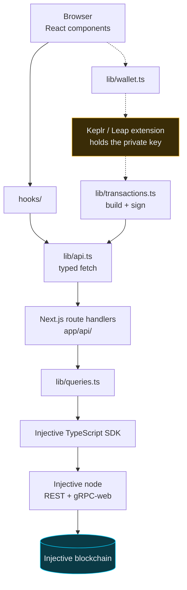
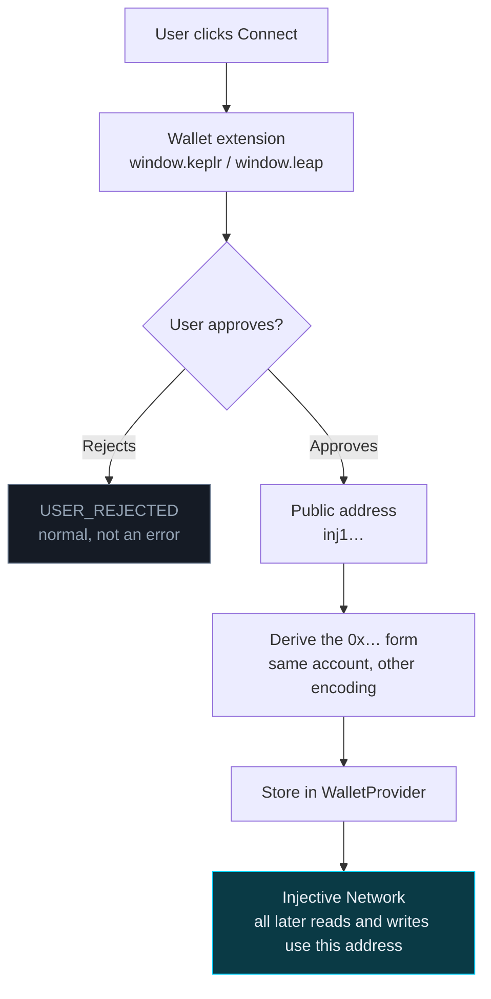
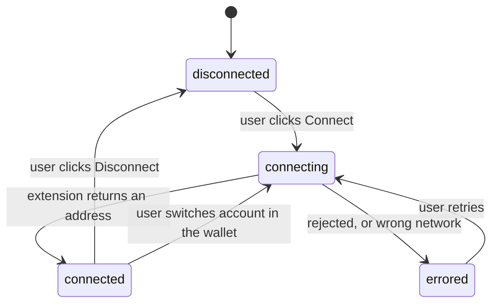
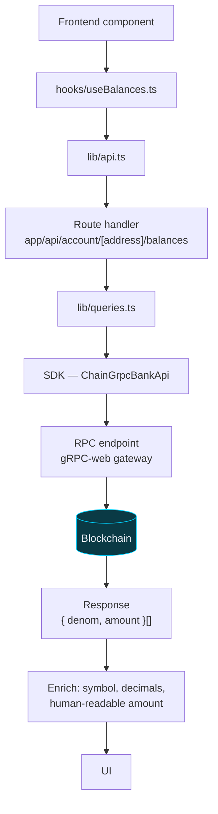
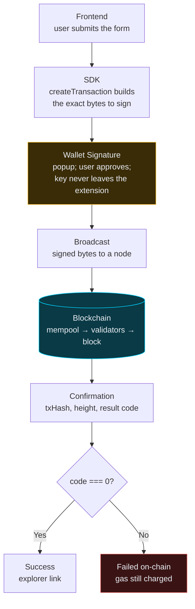
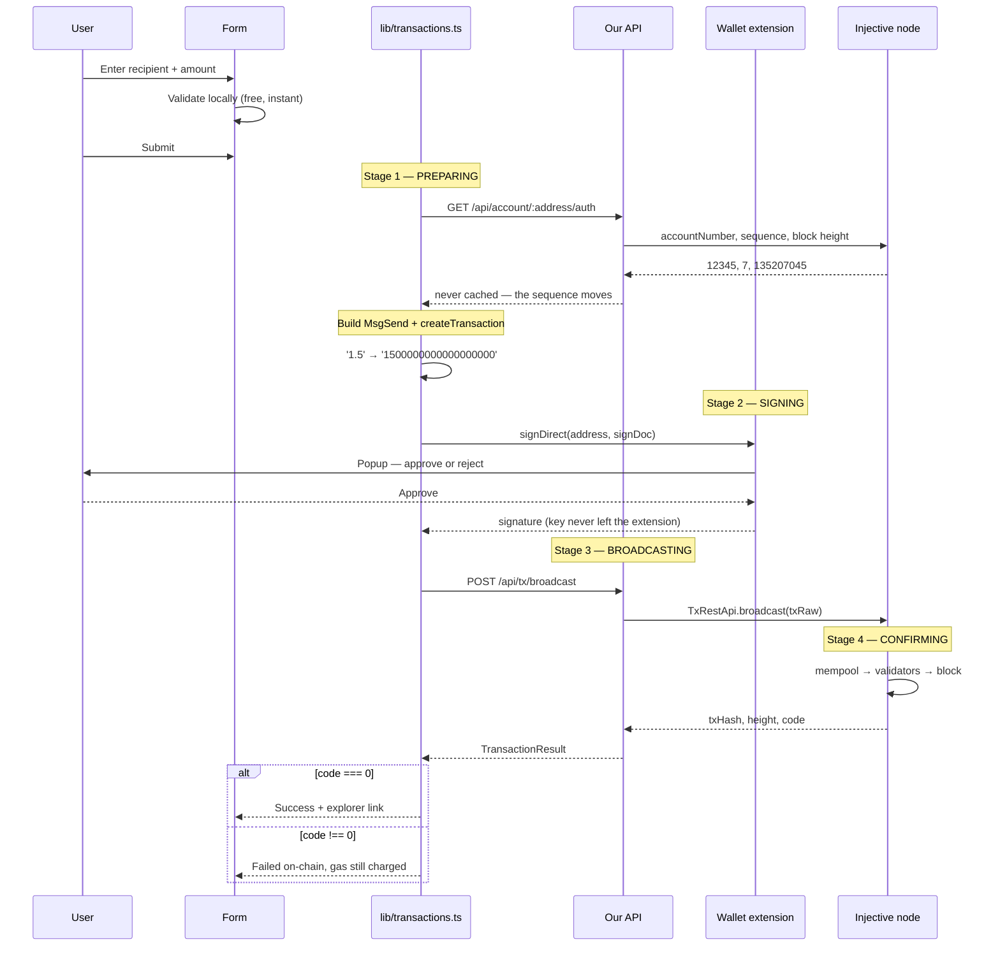

# Injective dApp Starter — learn by reading the code

A complete, working, **fully documented** full-stack Injective application built
with Next.js, TypeScript, Tailwind CSS and the official Injective TypeScript SDK.

This is not a template you copy and modify. It is a **tutorial written as a
codebase**. Every file opens with an explanation of what it does, why it exists
and how it fits into the whole. Every exported function carries a JSDoc block
with its purpose, parameters, return value, an example and its internal
workflow. Every non-obvious line has a comment that teaches a concept rather than
narrating the syntax.

If you read this repository top to bottom, you will understand how Injective
development actually works.

---

## Table of contents

1. [Project overview](#1-project-overview)
2. [Learning objectives](#2-learning-objectives)
3. [Prerequisites](#3-prerequisites)
4. [Installation](#4-installation)
5. [Environment setup](#5-environment-setup)
6. [Running locally](#6-running-locally)
7. [Project structure](#7-project-structure)
8. [Architecture](#8-architecture)
9. [Wallet connection flow](#9-wallet-connection-flow)
10. [Reading blockchain state](#10-reading-blockchain-state)
11. [Writing transactions](#11-writing-transactions)
12. [The transaction lifecycle](#12-the-transaction-lifecycle)
13. [SDK overview](#13-sdk-overview)
14. [Frequently asked questions](#14-frequently-asked-questions)
15. [Common errors and troubleshooting](#15-common-errors-and-troubleshooting)
16. [Useful learning resources](#16-useful-learning-resources)
17. [Next learning steps](#17-next-learning-steps)

---

## 1. Project overview

### What it does

The app is a single page with four panels, arranged in the order you should meet
the concepts. Each step depends only on the ones before it.

| Step | Panel | What it teaches |
| --- | --- | --- |
| 1 | **Network status** | Reading a blockchain is permissionless. No wallet, no account, no gas. |
| 2 | **Your account** | Connecting a wallet, and why an Injective account has two address formats. |
| 3 | **Your balances** | Denominations, decimals, and the gap between what the chain stores and what people read. |
| 4 | **Send INJ** | The complete write path: build a message, sign it, broadcast it, watch it confirm. |

Step 4 is a genuine end-to-end blockchain interaction. You will sign a real
transaction with a real wallet, it will be included in a real block, and you will
be able to find it on a public block explorer.

### What makes it a learning resource rather than a template

- **Every file has a documentation header.** What it does, why it exists, when to
  use it, what depends on it, and the execution flow through it.
- **Every exported function has full JSDoc**, including a worked example and a
  step-by-step description of what happens inside.
- **Comments teach concepts, not syntax.** You will not find `// increment
  counter`. You will find explanations of why token amounts are strings, why a
  sequence number cannot be cached, and why signing happens in the extension.
- **Errors are the curriculum.** `lib/errors.ts` translates every realistic
  blockchain failure into a message that says what happened *and* what to do
  about it. In a workshop, most of the learning happens when something breaks.
- **The four data states are all built.** Loading, error, empty and populated —
  including the empty state that most tutorials forget.

### Tech stack

| Layer | Choice | Why |
| --- | --- | --- |
| Framework | Next.js 15 (App Router) | Server Components, route handlers, one project for frontend and backend |
| Language | TypeScript 5.9 (strict) | On a ledger, a compile error is cheaper than a runtime one |
| Styling | Tailwind CSS v4 | Design tokens live in CSS; no config file to explain |
| Chain SDK | `@injectivelabs/sdk-ts` 1.20 | The official SDK |
| Wallets | Keplr and Leap, via direct injection | Fewer dependencies, and you can see exactly what a wallet API is |
| State | React Context | Built in, and the entire mechanism fits in one readable file |

---

## 2. Learning objectives

By the end you will be able to explain, and to implement:

**Concepts**

- What a blockchain read is, and why it needs no permission, no account and no gas
- What a blockchain write is, and why every part of it is different from a read
- Why the private key never touches your application code
- What a chain id is, and why it makes a transaction impossible to replay elsewhere
- What an account number and a sequence number are, and why the sequence must never be cached
- Why token amounts are integers in the smallest unit, and why they are strings in JavaScript
- What a denomination is, and why it does not tell you how many decimals a token has
- What gas is, how the fee is computed, and why you cannot send your entire balance
- What instant finality means and how it differs from waiting for confirmations

**Skills**

- Connect Keplr or Leap and read the connected address
- Query balances, block height and account state with the SDK
- Build a `MsgSend`, have a wallet sign it, and broadcast it
- Convert between human-readable and on-chain amounts without losing precision
- Handle every realistic failure with an error message a beginner can act on
- Model wallet connection as a state machine instead of a boolean
- Avoid the classic Next.js hydration mismatch in wallet-aware UIs

---

## 3. Prerequisites

### Knowledge

You should be comfortable with JavaScript, and have seen React before —
components, `useState`, `useEffect`. You do **not** need any prior blockchain,
Cosmos or Injective experience. Everything chain-specific is explained where it
first appears.

### Software

| Requirement | Version | Check with |
| --- | --- | --- |
| Node.js | 20.9 or newer | `node --version` |
| npm | 10 or newer | `npm --version` |
| A Chromium or Firefox browser | current | — |

### A wallet extension

Install **one** of these, then reload any open tabs:

- [Keplr](https://www.keplr.app/download) — the most widely used Cosmos wallet
- [Leap](https://www.leapwallet.io/download) — a fast alternative with the same API

Create a wallet inside the extension and **write the recovery phrase down on
paper**. For a workshop, create a throwaway wallet you will never fund with real
money.

### Testnet INJ

Steps 1 to 3 work with an empty wallet. Step 4 needs a small amount of INJ for
gas. Get it free at **<https://testnet.faucet.injective.network>**.

> On Cosmos chains an account does not exist until it first receives tokens.
> Until the faucet has paid you, your address is valid but has no account behind
> it — which means you cannot send anything. That is expected. See
> [`ACCOUNT_NOT_FOUND`](#account-does-not-exist-on-chain-yet).

---

## 4. Installation

```bash
git clone <your-fork-url> injective-dapp-starter
cd injective-dapp-starter
npm install
```

The install pulls roughly 420 packages, most of them the Injective SDK's protobuf
and gRPC dependencies. It takes a couple of minutes on a first run.

---

## 5. Environment setup

```bash
cp .env.example .env.local
```

`.env.example` is committed and contains only placeholders. `.env.local` is
git-ignored and is where your real values go. **The defaults work as-is** — you
can skip straight to running the app.

### The variables

| Variable | Visibility | Default | Purpose |
| --- | --- | --- | --- |
| `NEXT_PUBLIC_INJECTIVE_NETWORK` | public | `testnet` | `testnet` or `mainnet` |
| `INJECTIVE_REST_ENDPOINT` | **server only** | Injective's public LCD | Override with a dedicated node |
| `INJECTIVE_GRPC_ENDPOINT` | **server only** | Injective's public gRPC-web | Override with a dedicated node |
| `NEXT_PUBLIC_POLL_INTERVAL_MS` | public | `15000` | How often panels refresh |

### The `NEXT_PUBLIC_` rule — this matters

Next.js has exactly one rule for environment variables:

- A variable named `NEXT_PUBLIC_SOMETHING` is **inlined into the browser bundle**
  at build time. Anyone who opens DevTools can read it.
- A variable without that prefix is readable **only on the server**.

So:

```
Public/harmless (chain id, network name)  ->  NEXT_PUBLIC_
Secret (paid RPC keys, API tokens)        ->  no prefix
```

This project performs all chain reads on the server precisely so that a paid RPC
endpoint can stay secret. See [Architecture](#8-architecture).

> **Changing `.env.local` requires restarting the dev server.** Environment
> variables are read at startup, not per request. This trips up almost everyone
> at least once.

---

## 6. Running locally

```bash
npm run dev
```

Open <http://localhost:3000>.

| Command | What it does |
| --- | --- |
| `npm run dev` | Development server with hot reload |
| `npm run build` | Production build |
| `npm start` | Serve the production build |
| `npm run lint` | ESLint |
| `npm run typecheck` | `tsc --noEmit` |

### Verify it works, in order

1. **Network status shows a block height that increases.** If yes, your
   connection to Injective works. If no, nothing else will — fix this first.
   You can test the backend directly:

   ```bash
   curl http://localhost:3000/api/chain/status
   # {"ok":true,"data":{"chainId":"injective-888","latestBlockHeight":"135207045",…}}
   ```

2. **Click "Connect Wallet"** and approve the popup. Your address appears.

3. **Balances load.** An empty list is a valid, successful result for a new
   wallet — the panel says so explicitly.

4. **Send INJ to yourself.** Click "Use my own address", enter `0.01`, and watch
   the four-stage stepper. Then click through to the block explorer.

---

## 7. Project structure

Every directory has one job.

```
injective-dapp-starter/
│
├── app/                          Next.js App Router: routes and the backend
│   ├── layout.tsx                Root layout — HTML shell, fonts, providers
│   ├── page.tsx                  The single page; the workshop's running order
│   ├── globals.css               Tailwind import + design tokens
│   ├── icon.svg                  Favicon (the filename is the config)
│   └── api/                      Route handlers — this project's backend
│       ├── _shared.ts            Shared response envelope and status mapping
│       ├── chain/status/         GET  latest block
│       ├── account/[address]/
│       │   ├── balances/         GET  all token balances
│       │   └── auth/             GET  account number + sequence
│       └── tx/broadcast/         POST a signed transaction
│
├── components/                   Rendering only. No fetching, no chain logic.
│   ├── ui/                       Generic primitives, reusable in any project
│   │   ├── Button.tsx            Variants, sizes, loading state
│   │   ├── Card.tsx              The panel frame
│   │   ├── Alert.tsx             Message + hint + retry
│   │   ├── EmptyState.tsx        The state everyone forgets
│   │   ├── Spinner.tsx           Accessible loading indicator
│   │   ├── Skeleton.tsx          Shape-preserving placeholder
│   │   ├── Badge.tsx             Status pills, incl. the network indicator
│   │   └── CopyButton.tsx        Display truncated, copy in full
│   ├── layout/                   Header and Footer
│   ├── wallet/                   Connect button, picker modal, account panel
│   ├── chain/                    Network status panel
│   ├── balances/                 Balance list and row
│   └── transfer/                 Send form, lifecycle stepper, receipt
│
├── context/
│   └── WalletProvider.tsx        Wallet state for the whole app
│
├── hooks/                        React state wrapped around lib/ logic
│   ├── useWallet.ts              Reads the wallet context
│   ├── useBalances.ts            Fetch + poll + race-condition guards
│   ├── useChainStatus.ts         Fetch + poll the latest block
│   ├── useSendInj.ts             Drives the transaction lifecycle
│   ├── useIsMounted.ts           Prevents hydration mismatch
│   └── useCopyToClipboard.ts     Copy with transient confirmation
│
├── lib/                          All blockchain logic. No React anywhere.
│   ├── constants.ts              Network, chain id, endpoints, gas, tokens
│   ├── clients.ts                Memoised SDK client instances (server)
│   ├── queries.ts                Every read  (server)
│   ├── transactions.ts           Every write (browser — needs the wallet)
│   ├── wallet.ts                 Detect, connect, get a signer (browser)
│   ├── api.ts                    Typed fetch client for our own API (browser)
│   ├── errors.ts                 Failure translation. The teaching centrepiece.
│   └── helpers.ts                Unit conversion, explorer links, fees
│
├── types/                        Shared type vocabulary
│   ├── index.ts                  Barrel — import types from '@/types'
│   ├── injective.ts              Coin, Balance, ChainStatus, TransactionResult
│   ├── wallet.ts                 WalletId, WalletStatus, WalletAccount
│   ├── api.ts                    The request/response contract
│   └── global.d.ts               Teaches TS about window.keplr / window.leap
│
├── utils/                        Generic helpers. Nothing chain-specific.
│   ├── format.ts                 Display formatting (lossy, terminal step)
│   ├── validation.ts             Input validation before anything irreversible
│   └── cn.ts                     Conditional class names
│
├── public/                       Static files served as-is (see public/README.md)
└── tasks/                        Build notes and lessons captured while writing
```

### The layering rule

```
components/   rendering only          — may import hooks/, utils/, types/
   ↓
hooks/        React state             — may import lib/, types/
   ↓
lib/          pure logic, no React    — may import types/, utils/
   ↓
types/        vocabulary              — imports nothing
```

Dependencies point downward only. That is what makes `lib/transactions.ts`
runnable from a script or a test with no React in sight, and it is why you can
replace polling with WebSocket streaming without touching a single component.

---

## 8. Architecture

### The big picture



Solid arrows are the read path. Dotted arrows are the signing path, which never
leaves the browser.

### Two paths, one app

| | Read path | Write path |
| --- | --- | --- |
| Needs a wallet | No | Yes |
| Needs gas | No | Yes |
| Where the SDK runs | Server (route handlers) | Browser (build + sign) |
| Changes chain state | Never | Yes, permanently |
| Costs money | No | Yes |
| Can be undone | N/A | **No** |

### Why reads go through our own server

This project does **not** call Injective nodes directly from the browser. Every
read goes through a Next.js route handler first. Four reasons:

1. **Endpoint privacy.** Production apps buy dedicated nodes with the key in the
   URL. A browser-side read publishes that URL to every visitor. Server-side,
   `INJECTIVE_GRPC_ENDPOINT` never leaves the machine.
2. **No CORS.** A browser can only call endpoints that explicitly permit your
   origin. Servers have no such restriction. During a live workshop this removes
   an entire category of "works on my machine" failures.
3. **Bundle size.** The Injective SDK is large. Keeping reads server-side keeps
   most of it out of the JavaScript your users download.
4. **It is a good habit.** Treating chain access as backend infrastructure is how
   real applications are built.

**The honest trade-off:** you add one network hop, and you need a server. A
purely static dApp on IPFS cannot do this and must read from the browser — which
is completely valid, and what the SDK's own examples show. If that is your
deployment target, move the `lib/queries.ts` calls into your components and
delete `app/api/`. Everything else stays the same.

### What the server can and cannot do

The server relays bytes. It never signs anything, never holds a key, and cannot
modify a transaction — the signature covers every byte, so any change would
invalidate it. The worst a malicious relay could do is refuse to broadcast, which
you would notice immediately because no hash comes back.

---

## 9. Wallet connection flow

### The mental model

"Connecting a wallet" sounds like a network operation. It is not. Nothing is sent
anywhere, no session is created on any server, and the blockchain is never told
that you connected.

What actually happens:

1. A browser extension has injected an object onto `window`.
2. Your code calls a method on that object.
3. The extension shows the user a popup.
4. If they approve, the extension hands your page a public address.

That is the whole thing. "Connected" is a fact your JavaScript remembers, nothing
more.

### The flow



### In code

```ts
// lib/wallet.ts — the two calls that matter

// 1. Ask permission. THIS is what opens the popup.
await provider.enable(CHAIN_ID)

// 2. Read the account. Everything returned here is public information.
const key = await provider.getKey(CHAIN_ID)
// key.bech32Address === 'inj1…'
```

### Connection is a state machine, not a boolean

Modelling it as `useState(false)` produces three bugs immediately: a flash of
"Not connected" on every reload, no way to disable the button during a
connection, and a stuck UI after an error. So the app uses an explicit state
machine (`types/wallet.ts`):



Invariants the provider maintains: `status === 'connected'` if and only if
`account !== null`; `status === 'errored'` if and only if `error !== null`.

### Two addresses, one account

Every Injective account has two textual forms of the same 20 bytes:

```
inj1dzq677l6tdv8t7qcuwqt3jm5zv6edntwymwzsz   bech32, Cosmos-native
0x6881AF7bFA5b5875F818e380B8CB74133596CD6E   hex, Ethereum-compatible
```

They are **not two wallets**. Injective is a Cosmos chain with full EVM
compatibility, so the same key works in Keplr and in MetaMask. Cosmos tooling and
explorers want `inj1…`; EVM tooling wants `0x…`. The SDK converts losslessly with
`getInjectiveAddress()` and `getEthereumAddress()`.

### What "disconnect" really means

There is no disconnect on a blockchain, because there was never a connection.
Your app simply stops remembering the address. The extension may still consider
your site approved, which is why reconnecting often skips the popup. To genuinely
revoke access, the user removes your site from their wallet's connected-sites
list.

### Handling account switching

Keplr and Leap fire `keplr_keystorechange` / `leap_keystorechange` on `window`
when the user changes account. Handling it is what separates a dApp that feels
solid from one that feels broken — without it, the UI shows a stale address and
the next transaction fails with a signature mismatch. See the effect in
`context/WalletProvider.tsx`.

---

## 10. Reading blockchain state

### The flow



### Reading requires nothing

No wallet, no account, no signature, no gas, no permission. Blockchains are
public ledgers — that is the point of them. You can query any address on earth:

```bash
curl "http://localhost:3000/api/account/inj1dzq677l6tdv8t7qcuwqt3jm5zv6edntwymwzsz/balances"
```

This has a real consequence for how you think about a dApp: **"log in" is about
identity for signing, never about access to data.** Conflating the two is the
most common carry-over from web2, and it leads people to build authentication
that protects nothing.

### The three reads this app performs

```ts
// lib/queries.ts

// 1. Chain status — the simplest possible read.
const block = await getTendermintApi().fetchLatestBlock()

// 2. Balances — the bank module's ledger of who owns what.
const { balances } = await getBankApi().fetchBalances(address)

// 3. Account signing metadata — required before every transaction.
const account = BaseAccount.fromRestApi(await getAuthApi().fetchAccount(address))
```

### Denominations and decimals

The chain returns `{ denom: 'inj', amount: '1500000000000000000' }` and nothing
else. It does **not** tell you that this means 1.5 INJ.

A denom identifies *which* token. It never tells you *how many decimals* it has.
That knowledge is off-chain, maintained by wallets, explorers and registries.
Denoms you will see on Injective:

| Denom | Meaning |
| --- | --- |
| `inj` | The native gas token. 18 decimals. |
| `peggy0xdAC17F95…` | Bridged from Ethereum. Usually 6 decimals. |
| `factory/inj1…/mytoken` | Created with the token-factory module. |
| `ibc/C4CFF46F…` | Arrived over IBC from another Cosmos chain. |

`lib/constants.ts` holds a small hand-written registry, and `lib/helpers.ts`
degrades gracefully for anything not in it — the UI marks unknown tokens
"decimals unverified" rather than confidently showing a wrong number.

### Polling versus streaming

Blockchains do not push updates to web pages. Either you poll, or you open a
WebSocket.

This project polls every 15 seconds, because for a workshop the failure modes of
streaming — reconnection, backoff, ordering, missed events — are a distraction.
Two details in `hooks/useBalances.ts` are worth copying:

- **`isLoading` is true only for the first load.** If it flipped on every poll,
  the panel would flash a spinner every 15 seconds and users would read that as
  broken.
- **A failed refresh keeps the previous data.** Showing slightly stale data with
  a warning beats blanking the screen.

Streaming is listed under [Next learning steps](#17-next-learning-steps).

---

## 11. Writing transactions

### What changes when you write

| | Read | Write |
| --- | --- | --- |
| Permission | None | A signature from the key that owns the account |
| Cost | Free | Gas, paid in INJ |
| Speed | ~200ms | Seconds, one of which waits on a human |
| Reversible | N/A | **Never** |
| Can fail after succeeding | No | **Yes** — see below |

### The five stages



### The security model in one paragraph

Stage 3 is the only stage that requires the private key, and it is the only stage
that does not happen in your code. Your application composes an intent, the
user's wallet authorises it, and the network executes it. Your application is
never trusted with the key and therefore cannot be compromised into stealing
funds. Every design decision in `lib/transactions.ts` follows from that.

### The most important conversion in the codebase

Blockchains never store decimals. There is no `1.5 INJ` anywhere on Injective —
only an integer count of the smallest indivisible unit:

```
human-readable   1.5 INJ
on-chain amount  1500000000000000000
denom            "inj"
```

And you cannot do this arithmetic with JavaScript numbers. `Number` is a 64-bit
float, exact only up to 2⁵³ ≈ 9.007 × 10¹⁵. The value above is 1.5 × 10¹⁸ —
already past that. `0.1 * 1e18` in plain JS gives `100000000000000000.00000001`.
On a ledger, "usually correct" is not a strategy.

```ts
// lib/helpers.ts — always exact, never a float
toChainAmount('1.5', 18)                    // '1500000000000000000'
toHumanAmount('1500000000000000000', 18)    // '1.5'
```

`toChainAmount` rounds **down**, never up. If a user types more decimals than the
token supports, we move less of their money rather than more.

### Building the message

```ts
// lib/transactions.ts
const message = MsgSend.fromJSON({
  amount: { denom: 'inj', amount: chainAmount },   // base units, always
  srcInjectiveAddress: sender.injectiveAddress,
  dstInjectiveAddress: recipient,
})
```

A **message** is a single typed instruction to one Cosmos module. `MsgSend`
belongs to the bank module and means "move these coins from A to B". Injective
has dozens: place a spot order, delegate to a validator, execute a CosmWasm
contract. They all follow this pattern.

A transaction can carry several messages, and they execute **atomically** — all
succeed or all revert. That is how you build "swap and stake in one click".

### What actually gets signed

```ts
const { signDoc } = createTransaction({
  message,
  memo,
  fee: stdFee,
  pubKey,          // public, needed to verify the signature
  sequence,        // replay protection
  accountNumber,   // binds the signature to one account
  chainId,         // binds it to one chain
  timeoutHeight,   // an expiry
})
```

A Cosmos signature authorises **this message, from this account, on this chain, at
this point in that account's history, valid for roughly the next minute**. Very
little else in software is that specific.

### Delivery and execution are separate outcomes

This is the distinction that catches almost everyone. A transaction can be
perfectly delivered, mined into a block, charge the user gas, and still have
failed:

```ts
if (result.code !== 0) {
  // Included in a block. Fee charged. Message rejected.
}
```

`code === 0` means success. Anything else is a chain-level rejection explained by
`rawLog`. `app/api/tx/broadcast/route.ts` deliberately returns HTTP 200 for this
case, because the *broadcast* succeeded and the transaction hash — the most
useful thing you can have when something fails — must not be lost.

---

## 12. The transaction lifecycle

What the UI shows, and what is happening underneath.



### Timings, roughly

| Stage | Duration | Can fail with |
| --- | --- | --- |
| Preparing | ~200ms | `ACCOUNT_NOT_FOUND`, `RPC_UNAVAILABLE` |
| Signing | Unbounded — a human is involved | `USER_REJECTED`, `WRONG_NETWORK` |
| Broadcasting | ~300ms | `RPC_UNAVAILABLE` |
| Confirming | 1–3s | `TX_FAILED`, `INSUFFICIENT_BALANCE`, `SEQUENCE_MISMATCH` |

`components/transfer/TransactionStepper.tsx` renders this live. It exists purely
to teach: after one transfer, an attendee understands what "broadcasting" means
because they watched it happen.

### Instant finality

Injective uses CometBFT (formerly Tendermint) consensus, which gives **instant
finality**. Once a block is committed it can never be reverted. There is no
"wait for 6 confirmations" and no possibility of a chain reorganisation undoing
your transfer. One block is final.

---

## 13. SDK overview

### The packages

| Package | What it gives you |
| --- | --- |
| `@injectivelabs/sdk-ts` | Everything: query clients, message types, transaction building |
| `@injectivelabs/networks` | `getNetworkEndpoints()` — a lookup table of public endpoints |
| `@injectivelabs/utils` | `BigNumberInBase` / `BigNumberInWei` — exact decimal arithmetic |
| `@injectivelabs/ts-types` | `ChainId` and other shared enums |
| `@injectivelabs/exceptions` | The SDK's error classes |

### The shape of the SDK

The SDK is a family of small "API" classes, each wrapping one Cosmos module or
one transport. The naming is systematic once you see it:

```
Chain | Indexer  +  Grpc | Rest  +  <Module>  +  Api
```

| Class | Transport | Answers |
| --- | --- | --- |
| `ChainGrpcBankApi` | gRPC-web | Balances, supply, denom metadata |
| `ChainGrpcTendermintApi` | gRPC-web | Blocks |
| `ChainRestAuthApi` | REST/LCD | Account number and sequence |
| `ChainRestTendermintApi` | REST/LCD | Latest block, node info |
| `TxRestApi` | REST/LCD | Broadcast, look up a transaction |
| `IndexerGrpcAccountPortfolioApi` | gRPC-web | Derived portfolio data |

- **`Chain*`** talks to a node directly. Raw chain state.
- **`Indexer*`** talks to Injective's indexer, which serves derived data (order
  books, trade history, portfolios) that a raw node cannot answer.

**Why this project uses both REST and gRPC:** gRPC-web is the SDK's primary,
strongly-typed interface, so it is used for queries such as balances. The
REST/LCD gateway is what the official transaction documentation uses for the
account/block/broadcast trio, and it is the best-supported path for broadcasting.
Both hit the same nodes. Mixing them is normal in production Injective apps.

### The endpoints

```ts
import { Network, getNetworkEndpoints } from '@injectivelabs/networks'

const endpoints = getNetworkEndpoints(Network.Testnet)
// { rest, grpc, indexer, rpc, explorer, … }
```

This is a pure lookup — no network call happens.

| Endpoint | Protocol | Used for |
| --- | --- | --- |
| `rest` | HTTP + JSON ("LCD") | Accounts, blocks, broadcasting |
| `grpc` | Protobuf over HTTP | Every `ChainGrpc*Api` class |
| `indexer` | gRPC-web | Derived and historical data |
| `rpc` | Tendermint RPC | WebSocket streams |

### Message types

```ts
import { MsgSend, MsgExecuteContract, MsgDelegate } from '@injectivelabs/sdk-ts'
```

Every message follows the same pattern:

```ts
const msg = MsgSomething.fromJSON({ /* module-specific fields */ })
```

Which means: once you can send tokens, you can call a smart contract. The
surrounding lifecycle in `lib/transactions.ts` is identical — only the message
changes.

### Exact arithmetic

```ts
import { BigNumberInBase, BigNumberInWei } from '@injectivelabs/utils'

new BigNumberInBase('1.5').toWei(18).toFixed(0)   // '1500000000000000000'
new BigNumberInWei('1500000000000000000').toBase(18).toFixed()  // '1.5'
```

The names are inherited from Ethereum: **"base"** = human-readable unit,
**"wei"** = smallest unit. They apply to every token, not just ETH-derived ones.

---

## 14. Frequently asked questions

<details>
<summary><strong>Do I need my own node to build on Injective?</strong></summary>

No. Injective operates free public endpoints and `getNetworkEndpoints()` returns
them automatically. They are rate limited, so a production app should buy a
dedicated node — set `INJECTIVE_REST_ENDPOINT` and `INJECTIVE_GRPC_ENDPOINT` when
you do.
</details>

<details>
<summary><strong>Can this app steal my funds?</strong></summary>

No. It never has access to your private key — the key stays inside your wallet
extension, and every transaction requires you to approve it in a popup you can
read.

What any dApp *can* do is ask you to sign something misleading. That is why
wallets show transaction contents, and why you should read them. On testnet the
stakes are zero, which is exactly why you should learn to read them there.
</details>

<details>
<summary><strong>Why does the app have a backend at all? Aren't dApps supposed to be frontend-only?</strong></summary>

Many are, and that is a legitimate architecture. This one uses a thin backend for
chain *reads* so that a paid RPC endpoint stays private, CORS never comes up, and
the SDK stays out of the browser bundle. See
[Architecture](#8-architecture) for the full reasoning and the trade-off.

Critically, the backend never holds a key and never signs. Signing happens in the
browser, in your wallet.
</details>

<details>
<summary><strong>Why are token amounts strings and not numbers?</strong></summary>

Precision. JavaScript's `number` is a 64-bit float, exact only up to
2⁵³ ≈ 9 × 10¹⁵. A single INJ is 10¹⁸ base units — already past that. Storing a
balance as a number silently corrupts it.
</details>

<details>
<summary><strong>Why can't I send my entire balance?</strong></summary>

The gas fee is paid in INJ, out of the same balance. Sending everything would
leave nothing to pay the fee with, and the chain rejects the transaction *after*
it has been broadcast. The "Max" button leaves a small reserve for exactly this
reason.
</details>

<details>
<summary><strong>What is the difference between `inj1…` and `0x…`?</strong></summary>

Two encodings of the same 20 bytes, not two accounts. Cosmos tooling wants
`inj1…`; EVM tooling wants `0x…`. See
[Two addresses, one account](#two-addresses-one-account).
</details>

<details>
<summary><strong>Is my transaction really irreversible?</strong></summary>

Yes. Injective uses CometBFT consensus with instant finality — once a block is
committed it can never be reverted. There is no support line and no chargeback.
This is why `utils/validation.ts` is strict and why the send form disables
submission until every field is valid.
</details>

<details>
<summary><strong>How do I add support for another wallet?</strong></summary>

Add an entry to `SUPPORTED_WALLETS` in `lib/constants.ts` and add its window key
to `types/global.d.ts`. No other code changes — `lib/wallet.ts` reads the window
key from that data, so every wallet goes through one code path. This works for
any wallet implementing the Keplr API (Cosmostation, OWallet, and others).
</details>

<details>
<summary><strong>How do I send a token that isn't INJ?</strong></summary>

Change two things in `lib/transactions.ts`: the `denom` in the `MsgSend`, and the
decimals passed to `toChainAmount`. Everything else is identical. Remember the
fee is still paid in INJ.
</details>

<details>
<summary><strong>How do I call a smart contract instead?</strong></summary>

Swap `MsgSend` for `MsgExecuteContract`. The lifecycle in `lib/transactions.ts`
does not change at all — prepare, sign, broadcast, confirm. That is the payoff of
the message abstraction.
</details>

<details>
<summary><strong>Why does the block height sometimes jump by thousands?</strong></summary>

Injective produces a block roughly every 0.65 seconds and the app polls every 15
seconds, so you see one snapshot in every ~23 blocks. Lower
`NEXT_PUBLIC_POLL_INTERVAL_MS` if you want a smoother count, but be aware public
endpoints will rate limit you.
</details>

<details>
<summary><strong>Can I use this on mainnet?</strong></summary>

Yes — set `NEXT_PUBLIC_INJECTIVE_NETWORK=mainnet` and restart. The app switches
every badge to amber and shows a warning above the send form. Understand that
every transaction then moves real money and cannot be reversed.
</details>

---

## 15. Common errors and troubleshooting

Every error below is produced by `lib/errors.ts` with a message *and* a hint.
Read that file — it is a troubleshooting reference in its own right.

### `WALLET_NOT_INSTALLED` — Keplr is not installed in this browser

**What happened.** `window.keplr` is undefined. There is no registry of wallets —
an extension either injected itself into this page or it did not.

**Fix.** Install the extension, then **reload the page**. Extensions are only
detected on a fresh page load, so an existing tab will keep reporting it missing.

### `USER_REJECTED` — You cancelled the request in your wallet

**Not an error.** You were asked to approve something and said no. Nothing was
sent and no funds moved. This app deliberately styles it as neutral information
rather than a red banner — training users to see a crash every time they decline
is how a dApp starts to feel untrustworthy.

### `WRONG_NETWORK` — Your wallet is on a different chain

**What happened.** The wallet reported a chain id that does not match `CHAIN_ID`.
A transaction signed for `injective-888` is *cryptographically invalid* on
`injective-1`, so this must match exactly.

**Fix.** Switch networks inside the wallet, or change
`NEXT_PUBLIC_INJECTIVE_NETWORK` in `.env.local` and **restart the dev server**.

If the wallet has never heard of the chain, the app calls
`experimentalSuggestChain` automatically and the wallet offers to add it.

### `RPC_UNAVAILABLE` — Could not reach an Injective node

**What happened.** The node did not answer, or returned 429/502/503. Public
endpoints are rate limited and occasionally go down.

**Fix.** Check your connection and retry. If it persists, set
`INJECTIVE_REST_ENDPOINT` and `INJECTIVE_GRPC_ENDPOINT` to a dedicated node.

Note that in a browser, `fetch` reports DNS failures, refused connections **and
blocked CORS preflights** identically as "Failed to fetch" — the browser hides
which, deliberately. That ambiguity is a large part of why this project reads
server-side.

### `INSUFFICIENT_BALANCE` — Not enough INJ

**What happened.** Either the account has no INJ at all, or the amount plus the
fee exceeds the balance.

**Fix.** Get free testnet INJ from <https://testnet.faucet.injective.network>.

Remember that **the fee is always paid in INJ**, whatever token you are moving.
You can hold a million USDT on Injective and be unable to move any of it without
a little INJ for gas.

### `ACCOUNT_NOT_FOUND` — This address does not exist on-chain yet
<a id="account-does-not-exist-on-chain-yet"></a>

**What happened.** On Cosmos chains an account does not exist until it first
receives tokens. A brand-new wallet has a perfectly valid address, but querying
it returns 404 — there is no account number and no sequence to sign with.

**The consequence surprises everyone: you cannot send your first transaction
until somebody has sent you something.** On testnet, the faucet is that somebody.

**Fix.** Fund the address from the faucet, then try again.

### `SEQUENCE_MISMATCH` — Out-of-date account sequence number

**What happened.** Every account has a counter that increases by one per
successful transaction, and the value you signed for is part of the signature.
Yours moved on while this transaction was being prepared.

Two ways to hit it: sending two transactions in quick succession, or caching the
account and reusing a stale sequence.

**Fix.** Wait a couple of seconds and try again. This app re-reads the sequence
on every send and never caches it — see `lib/transactions.ts` stage 1.

### `TX_FAILED` — The chain rejected this transaction

**What happened.** Either the transaction was included in a block with a non-zero
result code, or it was rejected by the ante handler before execution.

The second case is worth knowing about: before a transaction is considered for a
block it passes a chain of checks verifying the signature, the account, the
sequence and that the fee can be paid. When one fails, Injective's REST gateway
sometimes cannot serialise the underlying error and answers with the genuinely
unhelpful `failed to marshal error message`. This app translates that into the
realistic causes.

**If it was included in a block, the gas fee was still charged.** Use the
transaction hash and look it up on the explorer.

### Hydration mismatch in the console

**What happened.** The server rendered "Connect Wallet" (no `window`, no wallet)
while the browser rendered a connected address. React compares the two and
complains.

**Fix.** Guard the component with `useIsMounted()`. See `hooks/useIsMounted.ts`,
which explains the mechanism in full.

### Changes to `.env.local` have no effect

Environment variables are read when the server starts, not per request. Stop the
dev server and start it again.

### `Module not found: Can't resolve 'fs'`

A blockchain library reached for a Node.js built-in in the browser bundle. Add it
to the `webpack.resolve.fallback` list in `next.config.ts` — the existing entries
show the pattern.

### Where to look when something is broken

1. **The terminal running `npm run dev`.** All server-side errors are logged
   there by `app/api/_shared.ts`, with the original cause attached.
2. **The browser console.** Wallet and client-side errors.
3. **`curl http://localhost:3000/api/chain/status`.** If this fails, nothing else
   can work — start here.

---

## 16. Useful learning resources

### Injective

- **[Injective docs](https://docs.injective.network)** — chain concepts, modules, guides
- **[injective-ts on GitHub](https://github.com/InjectiveLabs/injective-ts)** — SDK source and examples
- **[Testnet explorer](https://testnet.explorer.injective.network)** — every transaction, publicly
- **[Testnet faucet](https://testnet.faucet.injective.network)** — free INJ
- **[Injective Discord](https://discord.gg/injective)** — the `#developers` channel

### Cosmos fundamentals

Injective is a Cosmos SDK chain, so Cosmos knowledge transfers directly.

- **[Cosmos SDK docs](https://docs.cosmos.network)** — modules, messages, the ante handler
- **[Bank module spec](https://docs.cosmos.network/main/build/modules/bank)** — the module behind every balance and `MsgSend`
- **[CometBFT](https://docs.cometbft.com)** — the consensus engine that gives instant finality

### Wallets

- **[Keplr API docs](https://docs.keplr.app/api/)** — the interface `types/global.d.ts` describes
- **[Leap docs](https://docs.leapwallet.io)** — the same API, a different extension

### Standards worth reading once

- **[bech32 (BIP-173)](https://github.com/bitcoin/bips/blob/master/bip-0173.mediawiki)** — why addresses exclude `1`, `b`, `i` and `o`
- **[BIP-44](https://github.com/bitcoin/bips/blob/master/bip-0044.mediawiki)** — key derivation, and why Injective uses coin type 60 rather than 118

### The four files to read in this repo

| File | Why |
| --- | --- |
| `lib/constants.ts` | Chain ids, endpoints, gas, tokens. Everything else reads from it. |
| `lib/queries.ts` | Every read, and why reads need no wallet. |
| `lib/transactions.ts` | Every write. The five-stage lifecycle in full. |
| `lib/errors.ts` | What each blockchain failure means and how to fix it. |

---

## 17. Next learning steps

Roughly in order of difficulty.

### Straightforward extensions

1. **Send a token other than INJ.** Change the `denom` and the decimals in
   `lib/transactions.ts`. Notice the fee is still paid in INJ.
2. **Add a wallet.** One entry in `SUPPORTED_WALLETS` plus one line in
   `types/global.d.ts`. No logic changes.
3. **Show transaction history.** `IndexerRestExplorerApi` can list an account's
   past transactions. Add a route handler and a panel.
4. **Fetch real token metadata.** Replace the hard-coded registry in
   `lib/constants.ts` with the bank module's `fetchDenomsMetadata()`.

### Intermediate

5. **Simulate before signing.** `TxRestApi.simulate(txRaw)` returns the actual
   `gasUsed`. Set the limit from that plus a margin instead of a fixed number,
   and show the user a precise fee.
6. **Multiple messages in one transaction.** `createTransaction` accepts an
   array. They execute atomically — all succeed or all revert.
7. **Replace polling with streaming.** The SDK exposes WebSocket streams. You
   will own reconnection, backoff and missed-event recovery; that is the lesson.
8. **Adopt TanStack Query.** It handles caching, deduplication, background
   refetch and race conditions. Compare its behaviour to `hooks/useBalances.ts`
   and note what you wrote by hand.

### Advanced

9. **Call a CosmWasm contract.** Swap `MsgSend` for `MsgExecuteContract`. The
   surrounding lifecycle is unchanged — which is the whole point.
10. **Place a spot order.** Injective's exchange module is on-chain. This is the
    capability that distinguishes it from other Cosmos chains.
11. **Add EVM wallet support.** Injective supports Ethereum wallets via EIP-712
    signing. `getEip712TypedData` in the SDK is the entry point.
12. **Stake INJ.** `MsgDelegate` against the staking module, plus reward queries.

### Habits worth taking with you

- Model async state as a machine, not a boolean.
- Design all four data states — including the empty one.
- Keep chain logic free of React so it stays testable.
- Never cache a sequence number.
- Validate before you sign; validation is cheaper than gas.
- Write error messages that say what to do, not just what happened.

---

## Licence

MIT. Use it, fork it, teach with it.

## A note on the code comments

The comment density here is deliberately far higher than you would write in
production. This repository's job is to be *read*, and the comments are the
lesson. When you adapt it for real work, strip them back to the ones that explain
something non-obvious — which, for blockchain code, will still be more than you
expect.
