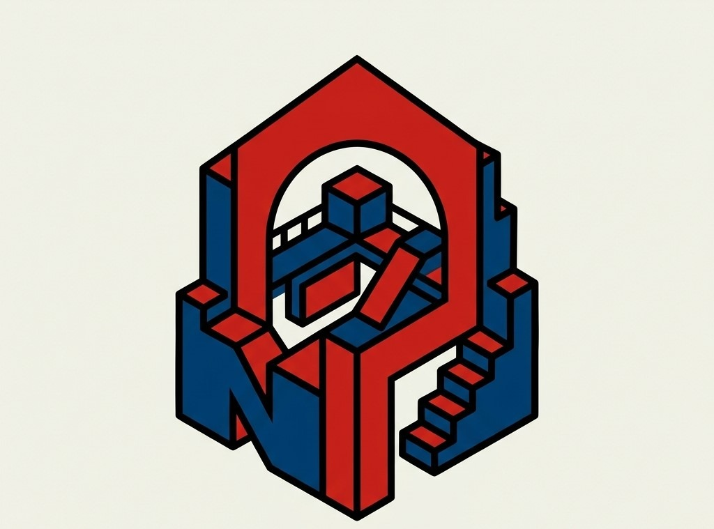

<div align="center">
  
  <h1>NovaTip</h1>
</div>

> Support creators instantly with fast, low-cost, on-chain donations powered by Injective.

**NovaTip** is a decentralized creator donation platform built on the Injective ecosystem. It enables users to support their favorite creators, open-source developers, and causes through secure, instant, and virtually feeless blockchain transactions.

---

## Features & Functionality

- **Wallet Connection**: Seamless Web3 integration with Keplr and Leap wallets.
- **Creator Dashboard**: Beautiful glassmorphic cards for creators.
- **Dynamic On-Chain Analytics**: Fully dynamic platform stats that track:
  - **Total Creators**: Real-time count of active creators on the platform.
  - **Total Value Tipped**: Aggregated INJ volume raised by all creators.
  - **Active Tippers**: Dynamic tracking of unique wallet addresses engaging with the platform.
- **Custom Creator Onboarding**: Users can add new creators dynamically. Data is persisted locally and updates platform analytics in real-time.
- **Quick Donations**: One-click predefined amounts (0.01, 0.05, 0.1, 0.5, 1 INJ) or custom tip values via a dedicated custom donation panel.
- **Live Transaction Feed**: A "Recent Tips" feed rendered below the creator grid, updating dynamically whenever a new tip is broadcasted.
- **Full Transaction Lifecycle**: Real-time feedback for Pending, Signing, Broadcasting, and Confirmed states.
- **Explorer Links**: Instant verification of successful donations on the Injective Explorer.
- **Responsive UI**: A fully mobile-responsive, premium tech aesthetic with a bespoke "NT" monogram logo and dark-mode styling.
- **Celebration Mode**: Confetti animations upon successful donations!

---

## Tech Stack

- **Framework**: [Next.js 15](https://nextjs.org/) (App Router)
- **Language**: [TypeScript](https://www.typescriptlang.org/)
- **Styling**: Vanilla CSS Modules & Utility Classes (Sleek Glassmorphic & Neon Gradient UI)
- **Blockchain SDK**: [@injective/sdk-ts](https://docs.injective.network/develop/ts-sdk/getting-started)
- **Wallet Provider**: [@injective/wallet-ts](https://docs.injective.network/develop/ts-sdk/getting-started)
- **State Management**: React Hooks (`useState`, `useEffect`) and Browser `localStorage` for dynamic persistence.
- **Animation**: `canvas-confetti`

---

## Getting Started

### Prerequisites
- Node.js (v18+)
- A compatible Cosmos wallet extension (e.g., Keplr or Leap).

### Installation

1. **Clone the repository:**
   ```bash
   git clone https://github.com/yourusername/NovaTip.git
   cd NovaTip
   ```

2. **Install dependencies:**
   ```bash
   npm install
   ```

3. **Configure Environment Variables:**
   Copy the example `.env.example` to `.env.local` and ensure your network is set up.
   ```bash
   cp .env.example .env.local
   ```
   *(By default, the app runs on the Injective Testnet for safe experimentation).*

4. **Run the development server:**
   ```bash
   npm run dev
   ```

5. **Open the App:**
   Visit [http://localhost:3000](http://localhost:3000) in your browser.

---

## What I Learned (Co-Learning Camp Journey)

Building NovaTip provided invaluable hands-on experience with the Injective ecosystem and modern frontend development:

1. **Wallet Integration**: I learned how to use `@injective/wallet-ts` to securely connect users via Keplr/Leap, request accounts, and handle state without exposing private keys.
2. **Cosmos Transactions**: I gained a deep understanding of the transaction lifecycle (Building -> Signing -> Broadcasting) and how to construct a `MsgSend` payload using `@injective/sdk-ts`.
3. **Dynamic State & Analytics**: Moving beyond hardcoded tutorials, I engineered dynamic hooks to calculate total volume tipped and active users by aggregating data across the application state in real-time.
4. **Data Persistence**: Learned to leverage browser storage events to sync state across different components (e.g., updating the global analytics when a new creator is added in a modal).
5. **Frontend Architecture**: Designed a responsive, highly polished consumer-facing dApp featuring custom assets, micro-interactions, and premium UI styling that elevates Web3 UX.

---

## Future Improvements

While this is a fully functional MVP for the Co-Learning Camp, future iterations could include:
- **Smart Contract Integration**: Storing the creator directory and donation history natively on-chain via CosmWasm rather than local/mock persistence.
- **Multi-token Support**: Allowing users to donate in USDT, USDC, or other CW20 tokens.
- **Creator Dashboard**: Enabling creators to log in, claim unique profiles, set goals, and withdraw funds.
- **NFT Badges**: Automatically minting a "Supporter Badge" NFT to users who donate above a certain threshold.

---

*Built with ❤ by Subham Roy for the Injective Co-Learning Camp.*
